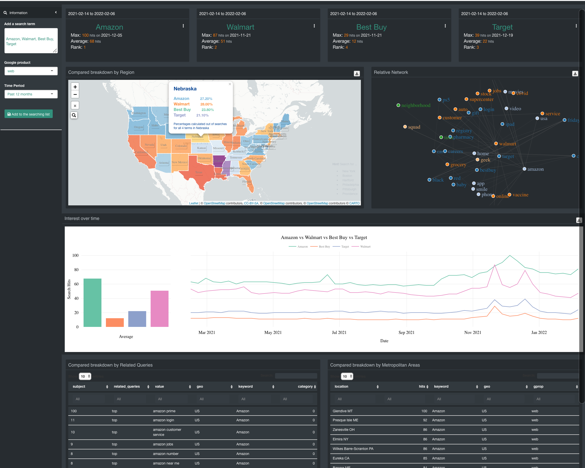
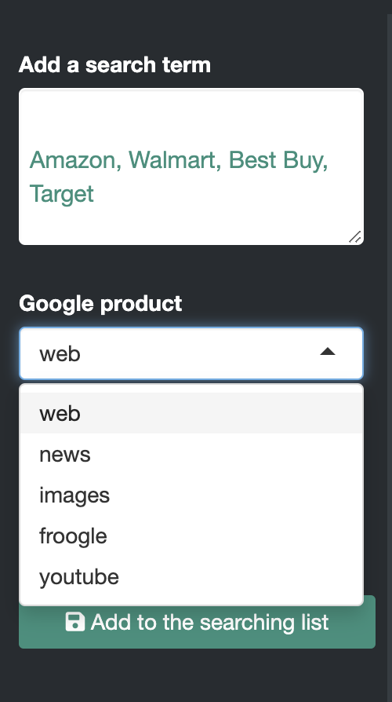
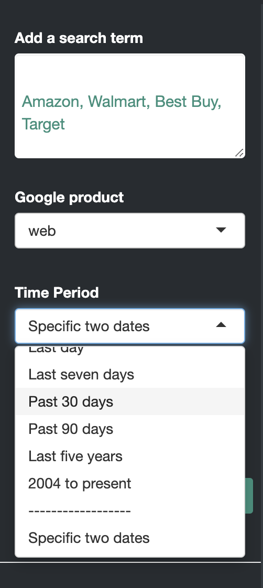
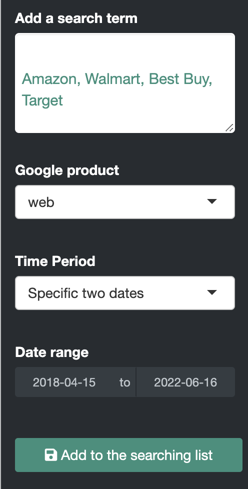
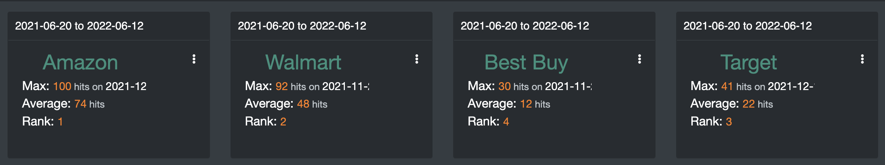
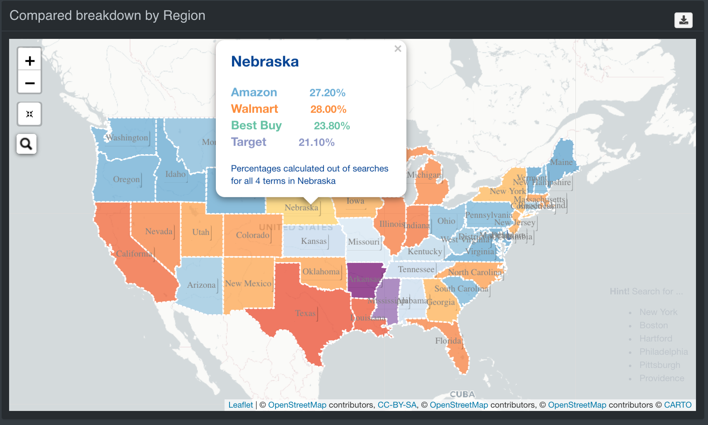
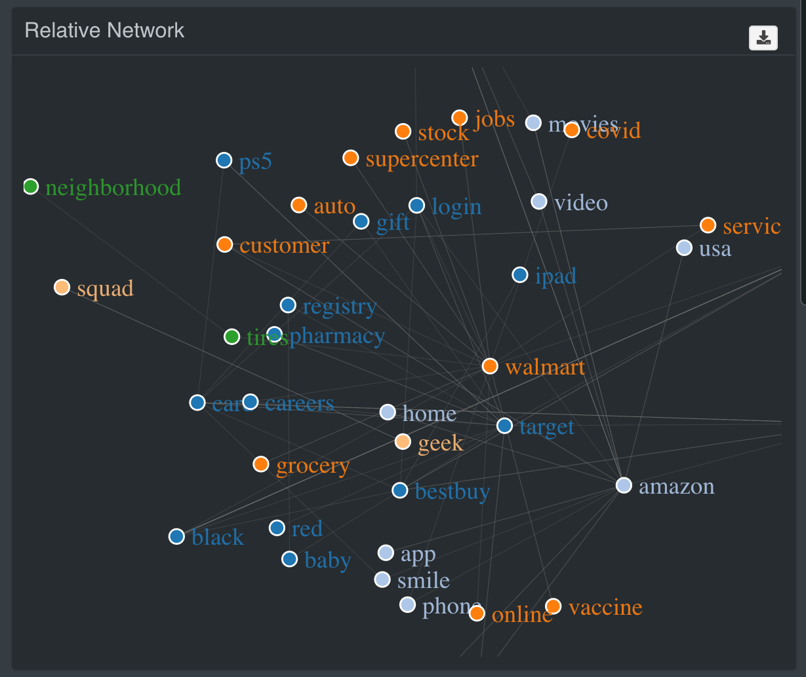
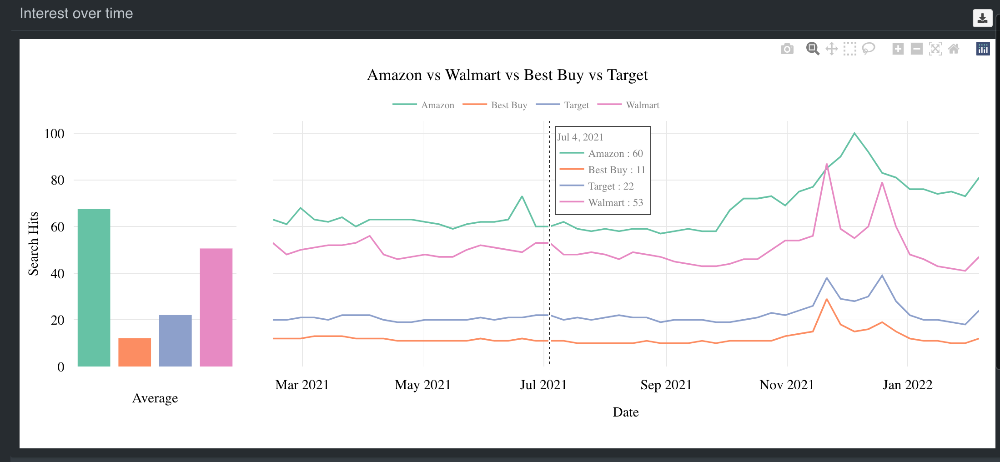
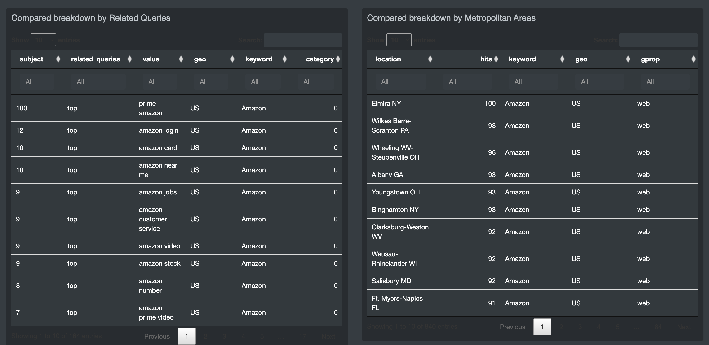

[R Shiny Applications in Finance, Medicine, Pharma and Education Industry]( https://kimloanrobinson.shinyapps.io/r_shiny_book_web/)

Google Trend Visualization Application
======================================

Google Trend Visualization Application is the third application in this
book, the purpose of this application help the user explores the
`gtrendsR` package
(<a href="https://github.com/PMassicotte/gtrendsR" class="uri">https://github.com/PMassicotte/gtrendsR</a>).
It is an interface for retrieving and displaying the information
returned online by Google Trends is provided. Trends (number of hits)
over the time as well as geographic representation of the results can be
displayed.

We will practice how to implement Google trend data into the app, create
the information boxes with complex function, an US map, and 3D networks
plot.

These are the features we cover in this chapter.

1.  User Inputs.

-   Add a search term with `textInput()`
-   Google Product with `selectInput()`
-   Time Period with `selectInput()`
-   Specific Date with `dateRangeInput()`
-   Add, Remove, Explore, Close, Download buttons with `actionButton`
    and `downloadButton`

    1.  The outputs.

-   Display the list of information boxes, which include the range of
    date, name of the key word, which date has the maximum of hits, the
    average of hits, and ranking between the keywords users provide.
-   There is an icon, which contains 2 buttons, one is Remove and
    another one is Explore. You either remove or explore more the
    subject you select.
-   US map represents the compare of the subjects by region. You will
    learn how to apply US map, add different colors, the hoover, and so
    on.
-   3D relative network plot, this is my favor plot, you will learn a
    lot about how the keywords connect.
-   The bar plot and line plot.
-   The last outputs contain the data table.
-   At the bottom of the application, there is a footer application.

    1.  The layout of the app

    The user inputs is on the right panel, the output is on the left
    panel.

Google Trend Visualization Application - Interface UI

Frontend/ User Interface UI
===========================

The user inputs
---------------

Let’s start with the UI/frontend design, we have the user inputs
i.e. add search term, Google product and period.

### Add a search term

We already discussed the ShinyDashboard structure in the
@ref(stock-front-structure) session. So let’s move on to user input.
Let’s start with `Add search term`, I used
`pickerInput(inputId = "stickers",choices = sticker$symbol)` which put
the `Sticker` data into `global.R`. You can see the following codes,
`choicesOpt = list(content = stringr::str_trunc(sticker$choices, width=30))`,
I wanted to cut the string of `sticker$choices` with the `width=30`

     textAreaInput("google_search","Add a search term",
                   value = "Amazon, Walmart, Best Buy, Target",height = "100px")

### Google product Input with `selectInput()`

Google provided 5 different product choices for search, they are “Web”,
“News”, “Images”, “Froogle”, “YouTube”. I used “web” by default

    output$google_pro <- renderUI({
      selectInput(
        "product",
        "Google product",
        choices = c("web", "news", "images", "froogle", "youtube"),
        selected = "web"
      )
    })

Google Products Input - Interface UI

### Time Period Inputs

There are many options for the time period that users choose. I used the
default library and two specific dates. If users select the second
option, another input parameter entered for duration will appear in the
`Specific two dates` section.

#### Default Time Period from the Library

I have provided 10 different choices for the time period, namely Last 12
months, Last hour, Last four hours, Last day, Last seven days and so on.
By the way, you will see the line break between 2004 and the present and
two specific dates. I just want to separate the default and manual date.

    output$time <- renderUI({
      selectInput(
        "time",
        "Time Period",
        choices = c(
          "Past 12 months" = "today 12-m",
          "Last hour" = "now 1-H",
          "Last four hours" = "now 4-H",
          "Last day" = "now 1-d",
          "Last seven days" = "now 7-d",
          "Past 30 days" = "today 1-m",
          "Past 90 days" = "today 3-m",
          "Last five years" = "today+5-y",
          "2004 to present" = "all",
          "------------------",
          "Specific two dates" = "specific"
        ),
        selected = "today 12-m",
        multiple = F
      )
    })

Time Period Input - Interface UI

#### Select Specific Dates Input

When the user selects `Two specific dates` from `Period`, the `Dates`
window is displayed. I used the `dateRangeInput ()` function. This
specified two dates for the window, a start date and an end date. Better
than using `dateInput()`

    output$spe_date <- renderUI({
        req(input$time)
        if(input$time == "specific")
          dateRangeInput(
            inputId = "dates",
            label = "Date range",
            start = "2018-04-15",
            end = Sys.Date())
      })

Google Specific Date - Interface UI

The outputs
-----------

### The information boxes

Let’s talk about the single box user interface. I start with the order
from top to bottom and left to right. I used `width = 3` for each box.
In the next chapter @ref(google-server-boxes) you will learn how to
reply and apply user input to create these boxes.

Information Boxes - Interface UI

1.  The date
    `title = htmlOutput(paste("1", name[[a]]), style = "text-align:left;")`
2.  I split the layout to 2 columns `cellWidths = c("70%", "30%")`
3.  In the left column, it’s typical text information, so I used the
    `renderText()` to render and `htmlOutput()` to print out the output

-   Name of the keyword
-   Maximum hits
-   Average hits.
-   Rank

1.  In the right column

-   There is an icon, which is `dropdownButton()`
-   When you click the icon, there are 2 buttons namely delete and
    explore `actionButton()` buttons, I assigned
    `onclick = 'Shiny.setInputValue(\"btnRem\", this.id, {priority: \"event\"})',`
    the button, useful for knowing which keyword we are citing.

<!-- -->

    box(
      width = 3,
      title = htmlOutput(paste("1", name[[a]]), style = "text-align:left;"),
      splitLayout(
        cellWidths = c("70%", "30%"),
        tagList(
          htmlOutput(name[[a]], style = "text-align:center;color:#32907c"),
          htmlOutput(paste("2", name[[a]]), style = "text-align:left;padding-left:10px;"),
          htmlOutput(paste("3", name[[a]]), style = "text-align:left;padding-left:10px;"),
          htmlOutput(paste("5", name[[a]]), style = "text-align:left;padding-left:10px;"),
          br()
        ),
        div(
          style = "text-align:right;height:150px;",
          tags$style(
            "#dropdown-menu-mydropdown2 {background-color: transparent;border-color: white;min-width:100px}
            .btn-custom {background-color: transparent; color: #FFF;}.caret{display: none;}"
          ),
          dropdownButton(
            inputId = "mydropdown2",
            label = "",
            icon = icon("fas fa-ellipsis-v"),
            status = "custom",
            circle = FALSE,
            actionButton(
              paste0("delete_", group[[a]]),
              "Remove ",
              onclick = 'Shiny.setInputValue(\"btnRem\", this.id, {priority: \"event\"})',
              style = "background-color: transparent;color:white;border-color: transparent;height:20px"
            ),
            br(),
            actionButton(
              paste0("explore_", group[[a]]),
              "Explore",
              onclick = 'Shiny.setInputValue(\"btnExp\", this.id, {priority: \"event\"})',
              style = "background-color: transparent;color:white;border-color: transparent;height:20px"
            )
          )
        )
      )
      
    )

### Compared breakdown by Region

A US map figure used to compare keywords by region. In this case, use
`LealetOutput(" map ", width =" 100% ", height =" 500px ")` to display
the map. Let’s use Amazon, Walmart, Best Buy, and Target as examples. I
chose blue for Amazon, orange for Wal-Mart, green for the best buy and
purple for the target audience.

The colors on the map represent the highest percentages of the area.
Percentage calculated from a search of all four terms by state.

We will discuss more about how to apply the hoover on the back end of
this chapter. You can use Google search to search for cities or states
on the map.

And finally, a drop-down menu with the “Download” button will appear in
the upper right corner of the box. Leave it as it is for now. Go back to
the next chapter @ref(google-server-region) to understand the details.

Google Map - Interface UI

### 3D Relative Network Plot

I used the `networkD3` library and the`forceNetwork()`function to create
the 3D relative network. It is quite complicated to process the data
before you even have a plot, you can read the next chapter
@ref(google-server-relative). We can learn how the relative keyword is
related, one thing for us is to look at it when analyzing.

Google Network Visualization - Interface UI

### Interest Over Time Plot

The bar graph represented the average number of results. The line graph
represented the number of hits per date. How to use `plotly` for bar and
line charts we will learn in the next chapter
@ref(google-server-timeseries)

Google Trend Linechart - Interface UI

### Related Queries Tables

At the end of the output there are 2 tables, Breakdown Compared for
Related Searches and Breakdown Compared for Metropolitan Areas. Again,
we will use `datatable` to create the tables. The next chapter  @ref
(google-server-table) shows how to create these tables.

Tables - Interface UI

